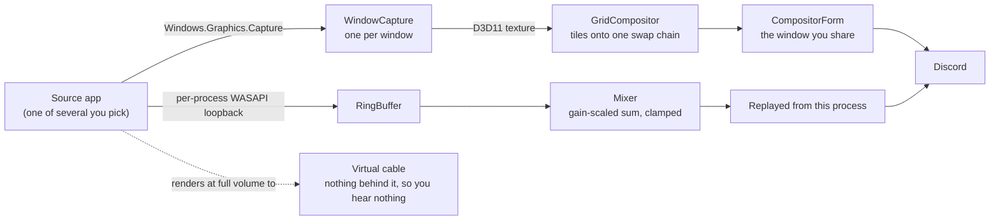

# MultiWindowShare

Share several application windows through Discord as one screenshare, and send their audio to viewers without hearing it yourself.

Discord only lets you share one window at a time, and "share with sound" only carries the audio of that one window's process. MultiWindowShare works around both limits. It captures each window you pick with Windows.Graphics.Capture, tiles them onto a single window, and you share that one window in Discord. For audio it captures each source app's output with per-process WASAPI loopback, mixes it, and re-plays the mix from its own process, so Discord's per-process sound capture picks up the whole mix.

## How the audio stays silent for you

The obvious approach, muting each source app so you don't hear it, does not work. Windows taps a process's audio after the session mute, so muting a source also zeroes what the capture sees. The spike in `spikes/P0EndpointSpike` measures this directly: playing a tone and toggling its own mute, captured level drops from about 0.177 RMS to 0.00001.

What does work is volume, not muting. A source keeps rendering at full volume, but to a playback device with no speakers behind it, so there is nothing to hear locally while the capture still gets a full-strength signal. Windows ships no such device, so this needs a virtual cable: VB-CABLE, Voicemeeter, or any equivalent. The app lists your playback devices and marks the ones that look like cables, and you choose which to use.

## Setting up the sink

A virtual cable has two halves: a playback endpoint that apps render into, and a recording endpoint that plays it back out. You only want the first one.

1. Pick a cable you are not already using for anything else. If you route audio through Voicemeeter or a mixer, check that the cable is not wired in as an input strip.
2. Enable only its playback endpoint. Leave the matching recording endpoint disabled. A disabled recording endpoint cannot be opened by anything, which is what stops the audio finding its way back to your speakers.
3. Make sure "Listen to this device" is off on the recording endpoint, in case you enable it later.
4. Rename the playback endpoint to something that says what it is, so you do not wire it into a mixer six months from now and wonder why you can hear your own screenshare.

Both steps are in the Sound control panel: `mmsys.cpl`, Playback tab, right-click and turn on Show Disabled Devices.

## Status

The video half works. Picking several windows tiles them into one shared surface, verified against live windows at their real resolutions. The picker and device selection are in place. The audio half is next: per-process capture and mixing exist as tested pieces, and the routing that ties them to the chosen cable is not wired up yet.

## Layout

- `src/MultiWindowShare` - the app: window enumeration, capture, the D3D11 grid compositor, audio device listing, and the picker.
- `src/MultiWindowShare.Core` - logic with no OS dependencies: the mixer, ring buffer, grid layout and fit math, cable detection. Unit-tested.
- `spikes/P0EndpointSpike` - the audio measurement described above.
- `tests/MultiWindowShare.Tests` - xUnit coverage of Core.

## Build and test

    ./build.ps1
    ./lint.ps1 -Check
    ./test.ps1

Needs the .NET 10 SDK (pinned in `global.json`) on Windows. `build.ps1` also activates `.githooks/`.

Three flags help when something looks wrong:

    MultiWindowShare.exe --list      # windows the picker will offer
    MultiWindowShare.exe --devices   # playback devices, cables marked
    MultiWindowShare.exe --smoke     # capture a few windows off-screen and report frame sizes

## Release build

    ./build.ps1 -Release

Produces a compressed, self-contained, single-exe win-x64 zip under `release/`. Tagging `vYYYY.M.D.N` builds and publishes the same zip as a GitHub release; see [.github/RELEASE_WORKFLOW.md](.github/RELEASE_WORKFLOW.md).

## Requirements

- Windows 11, or Windows 10 2004 and later without the borderless-capture option.
- A virtual audio cable for the silent path, once audio is wired up.
- In Discord, turn on "Use an experimental method to capture audio from applications" under Voice & Video -> Screen Share, then share the MultiWindowShare window (not a whole monitor) with sound enabled.
- Keep source windows restored. Minimized windows have no surface to capture.

Audio that only your viewers can hear is easy to misuse. Tell people when you are sending it.

## License

GNU General Public License v3.0; see [LICENSE](LICENSE).
